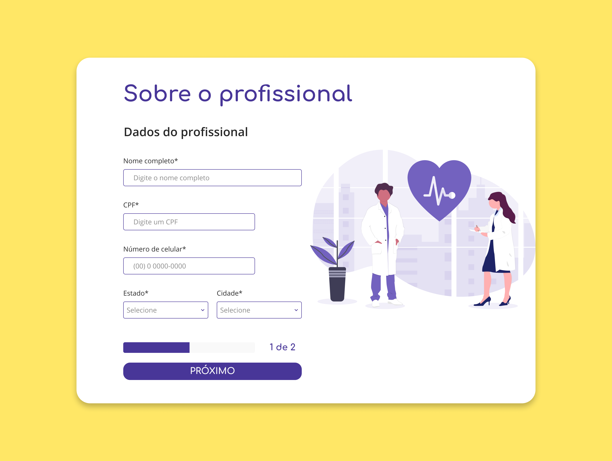

<h1 align="center">
  <br>
  
  <br>
  Teste Fácil Consulta
  <br>
</h1>

<h4 align="center">Teste para Front-end Vuejs com Bootstrap.</h4>

## Como usar

Para clonar e executar este aplicativo, você precisará de Git, Node.js e Yarn instalados no seu computador. Digite no seu terminal os comandos:

```bash
# Clone este repositório
$ git clone https://github.com/LuisSempre/testefacilconsulta

# Vá para o repositório
$ cd testefacilconsulta

# Instalar dependências
$ yarn

# Execute o aplicativo
$ yarn run serve
```

## License

MIT

---

> GitHub [LuisSempre](https://github.com/LuisSempre) &nbsp;&middot;&nbsp;
> Linkdein [LuisLucas](https://www.linkedin.com/in/luis-lucas-a5b30737/)

